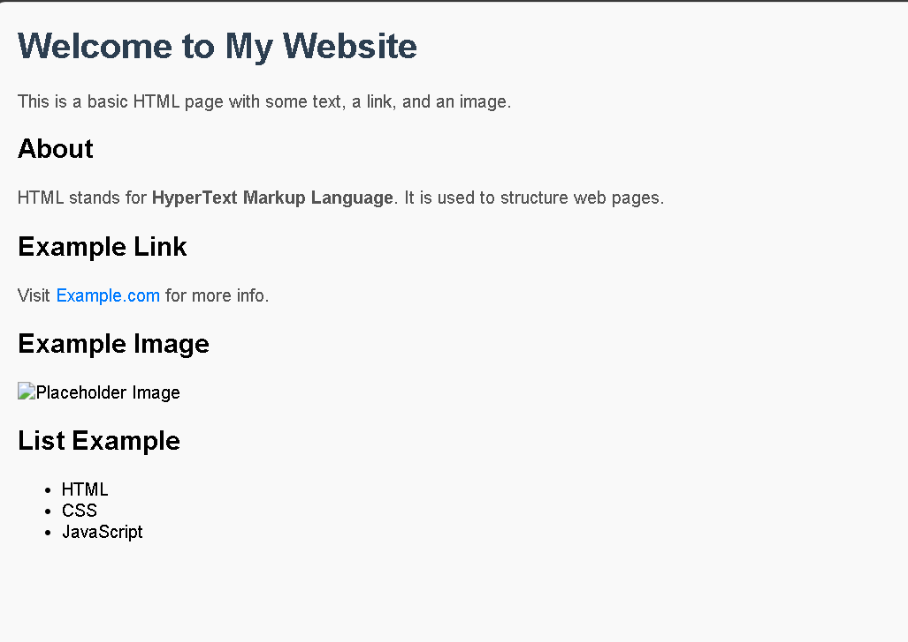

# web-development-
My First Webpage

📖 Description

This project is a simple static webpage built using HTML and basic CSS styling.
It demonstrates the fundamental structure of a web page including headings, paragraphs, hyperlinks, images, and lists.

The purpose of this project is to practice core frontend concepts and understand how HTML elements and CSS styling work together to create a webpage layout.

---

🧰 Technologies Used

- HTML5
- CSS3 (internal styling)

---

✨ Features

- Structured webpage using semantic HTML
- Styled text using CSS
- External link that opens in a new tab
- Displayed image using "" tag
- Unordered list
- Responsive meta viewport for mobile devices

---

📂 Project Structure

project-folder/
│── index.html
│── README.md
│── screenshot.png  

---

▶️ How to Run the Project

1. Download or clone this repository
2. Open the project folder
3. Double-click "index.html"
   OR
   Right click → Open with browser

The webpage will open locally in your browser.

---

🖼️ Preview

## Preview

---

🎯 What I Learned

- Basic HTML page structure
- Using headings, paragraphs, lists, and links
- Adding images in a webpage
- Applying CSS styling
- Creating a responsive webpage using viewport meta tag

---

👨‍💻 Author

Shravan Pal
Beginner Frontend Developer
Learning Web Development